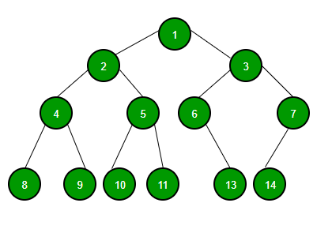

# Tree

 

## 정의

트리는 값을 가진 노드(node)와 이 노드들을 연결해주는 간선 (edge) 로 구성되어 있다.
- 맨 위에 있는 노드(1번)를 root node 라고 부른다.
- 모든 노드들은 0개 이상의 자식(child)를 갖고 있으며, 보통 이들의 관계를 부모-자식 관계로 표현한다.

### 특징

- 트리에는 사이클이 존재할 수 없다 (만약 사이클이 존재할 경우, 그래프)
- 모든 노드는 자료형으로 표현이 가능하다.
- Root에서 한 노드로 가는 경로는 오직 하나다.
- 노드의 갯수가 N이면, 간선은 N - 1개 이다.
- 데이터를 순차적으로 저장하지 않는 비선형(non-linear) 구조
- 트리에 서브 트리가 있는 재귀적 구조

 

## 트리 순회 방식

트리를 순회하는 방식은 총 4가지가 있다.

### 전위 순회 (Pre-order Traversal)

- 각 root를 순차적으로 방문하는 방식
- 그림에서 root를 시작으로, 각 노드의 왼쪽 면을 따라 그리면 아주 쉽게 방문 순서를 알 수 있다.

  > 1 → 2 → 4 → 8 → 9 → 5 → 10 → 11 → 3 → 6 → 13 → 7 → 14

### 중위 순회 (In-order Traversal)

- 왼쪽 하위 트리를 방문 후, root를 방문하는 방식이다 (왼쪽 자식 → Root → 오른쪽 자식).
- 그림에서 각 노드의 아래쪽 면을 따라 그리면 아주 쉽게 방문 순서를 알 수 있다.

  > 8 → 4 → 9 → 2 → 10 → 5 → 11 → 1 → 6 → 13 → 3 → 14 → 7

### 후위 순회 (Post-order Traversal)

- 왼쪽 하위 트리부터 하위를 모두 방문 후, root를 방문하는 방식이다 (왼쪽 자식 → 오른쪽 자식 →  Root).
- 그림에서 각 노드의 오른쪽 면을 따라 그리면 아주 쉽게 방문 순서를 알 수 있다.

  > 8 → 9 → 4 → 10 → 11 → 5 → 2 → 13 → 6 → 14 → 7 → 3 → 1

### 레벨 순회 (Level-order Traversal)

- Root부터 layer 별로 왼쪽에서 오른쪽으로 방문하는 방식이다.

  > 1 → 2 → 3 → 4 → 5 → 6 → 7 → 8 → 9 → 10 → 11 → 13 → 14

 

## Tree의 종류

### [Binary Tree](binarytree/BinaryTree.md)

  - [Binary Search Tree](bst/BinarySearchTree.md)