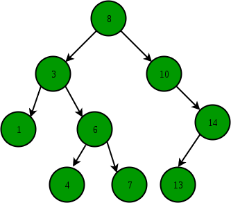

# Binary Search Tree

 

## Binary Search Tree란?

모든 노드의 왼쪽 서브 트리는 해당 노드의 값보다 작은 값들만 가지고, 모든 노드의 오른쪽 서브 트리는 해당 노드의 값보다 큰 값들만 가지는 트리 구조

- 각 노드의 자식이 2개 이하
- 각 노드의 왼쪽 자식은 부모보다 작고, 오른쪽 자식은 부모보다 큼
- 중복된 노드가 없어야 함

### 이진 탐색 트리의 목적

> Binary Search + Linked List

- Binary Search: **탐색에 소요되는 시간 복잡도는 `O(logN)`**, but 삽입 및 삭제가 불가능
- Linked List: **삽입, 삭제의 시간 복잡도는 `O(1)`** , but 탐색하는 시간 복잡도가 **`O(N)`**
- 이 둘을 합하여 장점을 모두 얻는 것이 **'이진 탐색 트리'**
    - 즉, 효율적인 탐색 능력을 가지고, 자료의 삽입 삭제도 가능하게 만들자

### 특징

중복이 없어야 하는 이유?
- 검색 목적 자료구조인데, 굳이 중복을 허용해 트리를 사용하여 검색 속도를 느리게 할 필요가 없음.
(트리에 삽입하는 것보다, 노드에 count 값을 가지게 하여 처리하는 것이 훨씬 효율적)

### 순회

- 이진 탐색 트리에서 **'중위 순회(in-order)' 방식** 을 사용하면 **정렬된 순서**를 읽을 수 있음

 

## Binary Search Tree 핵심 기능

- 검색
- 삽입
- 삭제
- 트리 생성
- 트리 삭제

 

## Time Complexity

- 균등 트리 : 노드 개수가 N개일 때 → `O(logN)`
- 편향 트리 : 노드 개수가 N개일 때 → `O(N)`

 

## 장단점

### 장점

- 삽입/삭제가 유연하다.
- 값의 크기에 따라 좌우 서브 트리가 나눠지기 때문에, 삽입/삭제/검색이 (일반적으로) 빠르다
- 정렬된 형태로 접근이 가능하다.

### 단점

- 편향된 트리일 경우, 성능이 좋지 않다.
- 이 문제를 해결하기 위해 self-balanced BST가 개발되었다.